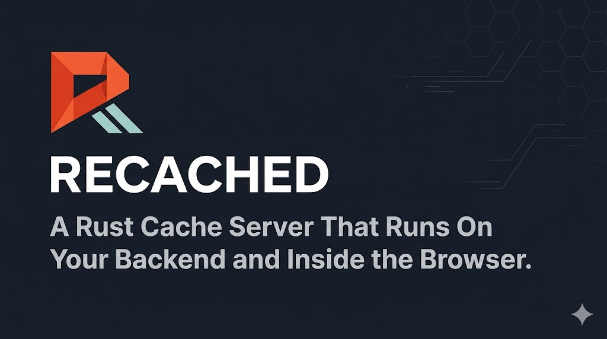

<div align="center">
  
  <h1>Recached ⚡</h1>
  <p><b>A Rust cache server that runs on your backend <em>and</em> inside the browser.</b></p>

  <a href="#"></a>
  <a href="#"></a>
  <a href="#"></a>
  <a href="#"></a>
</div>

---

**Recached** is an in-memory cache written in Rust with one idea that existing caches don't have: it compiles to WebAssembly so the same cache engine runs natively on your server *and* directly inside the browser or edge runtime, with the two sides kept in sync over WebSockets.

On the backend it speaks RESP, so any Redis client works against it today. In the browser, you import it as a `.wasm` module and get zero-latency local reads with automatic background sync to the server — no extra round-trips, no polling, no external state management library.

> [!WARNING]
> **Status: Active Development**
> The core protocol and sync architecture are solid, but Recached only implements a small subset of Redis commands today (`GET`, `SET`, `DEL`, `PING`, `AUTH`). It is not yet a Redis replacement for production workloads. Use it for local-first web apps, prototypes, and edge caching experiments.

---

## Why Recached exists

Every caching solution today forces a choice: put the cache on the server (latency on every read) or duplicate state in the client (stale data, cache invalidation hell). Recached removes that choice.

The `core-engine` crate is a pure Rust state machine with no network dependencies. It compiles to native code for the server and to `.wasm` for the browser. Both run the same logic. The WebSocket sync layer keeps them consistent — a `SET` on the server pushes to all connected browser instances automatically.

```
┌─────────────────┐        RESP (port 6379)        ┌──────────────────┐
│   Your backend  │ ──────────────────────────────► │  Recached Server │
└─────────────────┘                                 │  (server-native) │
                                                    └────────┬─────────┘
                                                             │ WebSocket
                                                             │ sync (6380)
                                                    ┌────────▼─────────┐
                                                    │  Browser / Edge  │
                                                    │  (wasm-edge)     │
                                                    │  local reads: 0ms│
                                                    └──────────────────┘
```

---

## Getting started

### Run the server

```bash
# Docker
docker run -p 6379:6379 -p 6380:6380 ghcr.io/thinkgrid-labs/recached:latest

# Homebrew (macOS)
brew tap thinkgrid-labs/recached && brew install recached && recached-server

# Cargo
cargo install recached && recached-server
```

### Use from your backend (any Redis client, port 6379)

```javascript
import Redis from 'ioredis';

const cache = new Redis('redis://127.0.0.1:6379');
await cache.set('user:1', 'Alice');
console.log(await cache.get('user:1')); // "Alice"
```

### Use from the browser (WebAssembly, port 6380)

```javascript
import init, { RecachedCache } from 'recached-edge';

await init();
const cache = new RecachedCache();

// Connects to the server and syncs state changes in the background
cache.connect('ws://127.0.0.1:6380');

cache.set('theme', 'dark');        // writes locally + pushes to server
console.log(cache.get('theme'));   // reads from local WASM memory — 0ms
```

Any `SET` or `DEL` on the server side is automatically pushed to all connected browser instances. Any write from the browser is pushed to the server and fanned out to other browser clients.

---

## Configuration

```bash
RECACHED_PASSWORD="secret"          \  # require AUTH; disconnects after 5 wrong attempts
RECACHED_ALLOW_IPS="127.0.0.1"     \  # comma-separated allowlist (invalid entries are logged + skipped)
RECACHED_MAX_KEYS="1000000"         \  # hard key cap; SET errors when reached
RUST_LOG="info"                     \  # log level: error / warn / info / debug
recached-server
```

---

## Architecture

Three crates with hard dependency boundaries:

| Crate | Role |
|---|---|
| `core-engine` | Pure state machine — no networking, no I/O. RESP parser (depth-limited), typed command dispatch, `Arc<RwLock<HashMap>>` store with optional key cap. Compiles to both native and `wasm32`. |
| `server-native` | Tokio TCP server (port 6379) + WebSocket server (port 6380). Persistent read buffers handle fragmented RESP. Connection semaphore, auth rate-limiting, sender-ID broadcast filter, structured `tracing` logging throughout. |
| `wasm-edge` | `wasm-bindgen` JS bindings. Local zero-latency reads, RESP-over-WebSocket sync with the server. Closure lifecycle is managed correctly — reconnecting doesn't leak memory. |

---

## What works today

- `PING`, `SET`, `GET`, `DEL`, `AUTH`
- RESP protocol — full parser/serializer, handles fragmentation, depth-limited (no stack-overflow DoS)
- TCP (port 6379) compatible with any Redis client
- WebSocket sync (port 6380) between server and browser WASM instances
- Sender-ID filter: browser clients don't double-apply their own mutations
- `RECACHED_PASSWORD` + brute-force lockout after 5 failures
- `RECACHED_ALLOW_IPS` with validated IP parsing
- `RECACHED_MAX_KEYS` memory cap
- Connection semaphore (max 1024 concurrent)
- Structured `tracing` logs

---

## Roadmap

### Redis command parity

The goal is full behavioral compatibility so Recached can be a genuine drop-in for Redis. This is unglamorous but necessary.

**Phase 2 — Strings & TTL**
- String ops: `APPEND`, `STRLEN`, `INCR`/`DECR`, `MGET`/`MSET`, `GETSET`, `SETNX`/`SETEX`, `SET EX/PX/NX/XX`
- Expiry: `EXPIRE`, `PEXPIRE`, `TTL`, `PTTL`, `PERSIST`, background lazy eviction
- Key ops: `EXISTS`, `TYPE`, `RENAME`, `SCAN`, `KEYS`, `DBSIZE`, `FLUSHDB`, `UNLINK`

**Phase 3 — Collections**
- Hash: `HSET`, `HGET`, `HGETALL`, `HDEL`, `HKEYS`, `HVALS`, `HLEN`, `HINCRBY`
- List: `LPUSH`, `RPUSH`, `LPOP`, `RPOP`, `LRANGE`, `LLEN`, `BLPOP`, `BRPOP`
- Set: `SADD`, `SMEMBERS`, `SREM`, `SCARD`, `SISMEMBER`, `SINTER`, `SUNION`, `SDIFF`
- Sorted Set: `ZADD`, `ZRANGE`, `ZSCORE`, `ZRANK`, `ZREM`, `ZCARD`, `ZINCRBY`

**Phase 4 — Advanced Redis**
- Pub/Sub: `SUBSCRIBE`, `PUBLISH`, `PSUBSCRIBE`
- Transactions: `MULTI`, `EXEC`, `DISCARD`, `WATCH`
- Persistence: RDB snapshots (`BGSAVE`), AOF with configurable `fsync`
- Replication: `REPLICAOF`, read-replica propagation
- Scripting: `EVAL`, `EVALSHA`
- Server: `INFO`, `CONFIG GET/SET`, `COMMAND`, `SLOWLOG`

---

### Beyond Redis

These are things Redis either can't do or requires paid modules/plugins for.

**Performance**
- [ ] **Sharded `DashMap` core** — swap `RwLock<HashMap>` for a lock-striped concurrent map; removes write bottleneck on high-core-count machines
- [ ] **RESP3 support** — richer native types (maps, doubles, blob errors) without client workarounds

**Ops**
- [ ] **Native TLS** — encrypt TCP and WebSocket connections without a sidecar
- [ ] **Built-in Prometheus metrics** — hit rate, latency percentiles, memory, connection counts at `/metrics`; no module needed
- [ ] **Pluggable eviction** — LRU, LFU, TTL-priority, ARC via `RECACHED_EVICTION=lfu`

**New primitives**
- [ ] **Native JSON type** — `JSET`, `JGET`, `JMERGE` with JSONPath; no RedisJSON module
- [ ] **Rate-limiting commands** — `RLSET key limit window` / `RLCHECK key`; replaces hand-rolled Lua scripts
- [ ] **Observable keys** — `WATCH key` over WebSocket delivers a push on every mutation; reactive bindings without polling
- [ ] **WASM server-side scripting** — run `.wasm` stored procedures instead of Lua; sandboxed, multi-language

**Edge & browser**
- [ ] **WASI target** — `wasm32-wasip1` build for Cloudflare Workers and Deno Deploy
- [ ] **Offline-first WASM** — IndexedDB persistence layer; cache survives refresh and syncs delta on reconnect
- [ ] **Typed TypeScript SDK** — generated from the command schema, zero-overhead WASM bindings

---

## Contributing

The most useful contributions right now:

1. **Phase 2 commands** — `INCR`, `EXPIRE`, `TTL` are the most-requested missing pieces
2. **Benchmarks** — `redis-benchmark` against Redis 7 on multi-core hardware (results welcome either way)
3. **Client examples** — React, Vue, or SvelteKit demos using `recached-edge`
4. **Bug reports** — edge cases in the RESP parser or WebSocket sync

Open a PR or file an issue.
